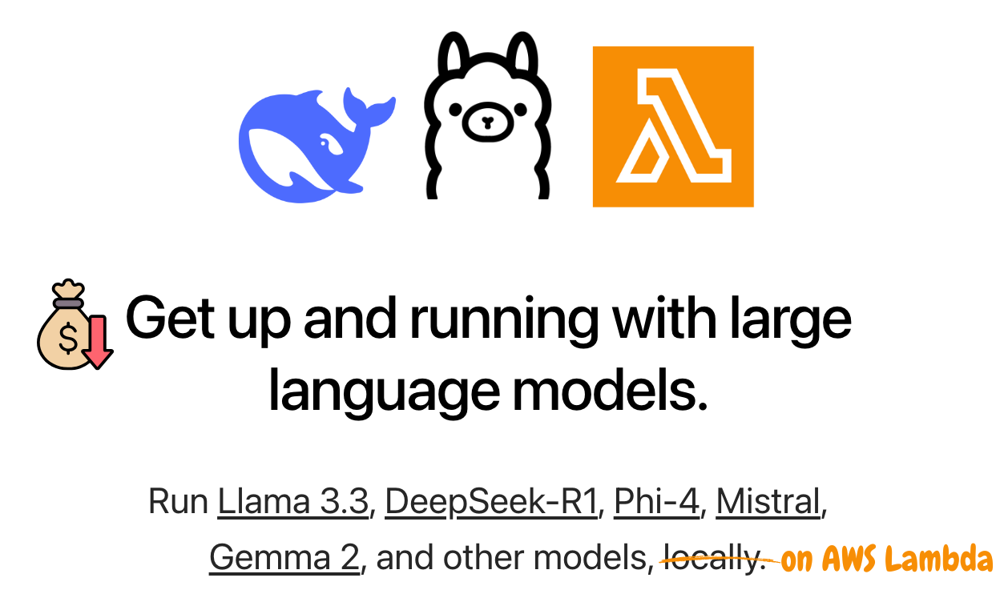

# **🚀 Deploying Large Language Models (LLMs) in AWS Lambda with Ollama**



This project enables **serverless LLM inference** using **AWS Lambda** with **Ollama** as Infrastracture as Code (IaC). It is designed to work **within Lambda’s limits** (max **10GB ephemeral storage** and **10GB memory**). Deploy Cutting-Edge LLMs like DeepSeek R1, Falcon, Mistral and LLaMA models... among others at the lowest cost on AWS Lambda with Ollama.

**To deploy your function, simply run**:

```bash
bash deploy.sh
```

This script automates the **entire setup**, including **image building, ECR upload, and Lambda deployment**.

---

## How does it work? 

**Distilled models** are smaller, optimized versions of LLMs that retain most capabilities while reducing computational overhead, making them ideal for serverless execution. **Ollama** enables efficient deployment of large language models (LLMs) locally. As a challenge, we are pushing the limits by deploying LLMs within AWS Lambda's 10GB ephemeral storage and memory constraints, optimizing for performance while maintaining flexibility.

For **production-grade applications**, AWS provides alternatives such as:  
- **DeepSeek-R1 and Llama distilled variants on Amazon SageMaker AI** for scalable inference.  
- **Amazon Bedrock (via Custom Model Import)** for managed model hosting.

## **1️⃣ AWS Lambda Resource Limits**

- **Memory**: **Up to 10GB** (`--memory-size 10240`).
- **Ephemeral Storage**: **Up to 10GB** (`--ephemeral-storage '{"Size": 10240}'`).
- **Timeout**: Currently set to **5 minutes (300s)**

These limits allow **running models within 10GB** (e.g., `deepseek-r1:8b`), but **larger models won’t fit** within this setup.

---

## **2️⃣ How AWS Lambda Runs Ollama**

### **How the Model is Handled in Ephemeral Storage (`/tmp`)**

- AWS Lambda **provides a temporary 10GB storage** at `/tmp`.
- The model is **downloaded only during the first run** (cold start) and stored in `/tmp/.ollama/models`.
- On **subsequent executions (warm start)**, the model **remains available in memory**, preventing repeated downloads.

This ensures **faster inference** without extra startup time **as long as the function stays warm**.

---

## **3️⃣ `awslambdaric`: Making Lambda Work with Ollama**

### **Why We Need `awslambdaric`**

AWS Lambda containers **don’t automatically run Python scripts** in the expected function format (`lambda_handler`). Instead, we use `awslambdaric` (**AWS Lambda Runtime Interface Client**) to:

- **Start an HTTP server inside Lambda.**
- **Bridge requests e.g from AWS API Gateway to our Python function.**
- **Keep the Lambda process alive while running Ollama.**

### **How It Works**

1. The **entrypoint script (`entrypoint.sh`)** starts:
   - The **Ollama LLM server (`ollama serve &`)** in the background.
   - The **Lambda runtime (`awslambdaric lambda_function.lambda_handler`)** in the foreground.
2. The runtime **waits for requests** and forwards them to the local Ollama API (`localhost:11434/api/chat`).
3. The **Lambda function (`lambda_function.py`)** handles user queries and retrieves responses from Ollama.

This setup ensures **AWS Lambda correctly processes requests** while keeping Ollama active.

---

## **4️⃣ API Usage: Running Any LLM Model**

### **How to Call the Lambda Function**

You can call the Lambda function in several ways:

1. **Using AWS CLI**:
```bash
aws lambda invoke \
  --function-name OllamaLambdaFunction \
  --payload '{"body": "{\"user_message\": \"Why is the sky blue?\", \"model_name\": \"llama3.2:1b\"}"}' \
  response.json
```

2. **Using Python with boto3**:
```python
import boto3
import json

lambda_client = boto3.client('lambda')

payload = {
    "body": json.dumps({
        "user_message": "Why is the sky blue?",
        "model_name": "llama3.2:1b"  # optional, defaults to deepseek-r1:8b
    })
}

response = lambda_client.invoke(
    FunctionName='OllamaLambdaFunction',
    Payload=json.dumps(payload)
)

result = json.loads(response['Payload'].read())
print(result['body'])
```

3. **Using AWS API Gateway** (if configured):
```bash
curl -X POST https://your-api-gateway-url.execute-api.region.amazonaws.com/stage \
  -H "Content-Type: application/json" \
  -d '{"user_message": "Why is the sky blue?", "model_name": "llama3.2:1b"}'
```

### **Example Request Payload**

The Lambda function accepts a **JSON payload** with a **custom message and model selection**:

```json
{
  "body": "{\"user_message\": \"Why is the sky blue?\", \"model_name\": \"llama3.2:1b\"}"
}
```

- The **default model** is `llama3.2:1b`, but **any model in Ollama's library** can be used as long as it fits in the memory of lambda.
- If the model is **not yet downloaded**, it will be **pulled at runtime**.
- **Larger models may require increasing the Lambda timeout** to **prevent failures while downloading**.

---

## **5️⃣ Deploying with Infrastructure as Code (`deploy.sh`)**

### **Why Use IaC?**

Infrastructure as Code (IaC) **automates AWS resource creation**, ensuring:
✅ **Consistency** – No manual setup errors.  
✅ **Repeatability** – Deploy the same stack anytime.  
✅ **Version Control** – Track changes via Git.

### **What `deploy.sh` Does (Step-by-Step)**

1. **Authenticates** with AWS Elastic Container Registry (ECR).
2. **Checks if the ECR repository exists** (creates it if needed).
3. **Builds the Docker image** with Ollama and Lambda runtime.
4. **Tags the image with a timestamp** for version control.
5. **Pushes the image** to AWS ECR.
6. **Deploys the Lambda function using AWS CloudFormation.**
7. **Forces AWS Lambda to update the image** (to ensure new deployments take effect).
### **Running the Deployment**

---

## **6️⃣ Next Steps**  

### **1️. Try Different LLM Models**  

### **2️. Enable AWS Lambda Response Streaming**  
- **Stream responses** instead of waiting for full output ([AWS Streaming](https://aws.amazon.com/blogs/compute/introducing-aws-lambda-response-streaming/)).  

### **3️. Add Memory & Conversation History**  
- **Use DynamoDB** to store chat history with a **Session ID**.  
- Modify `lambda_function.py` to **retrieve & update** session context.  

This project has been developed based on work by [Gloria Macia](https://www.linkedin.com/in/gloriamacia/). Find the original repository [here](https://github.com/gloriamacia/aws-lambda-deepseek-ollama-llm).
